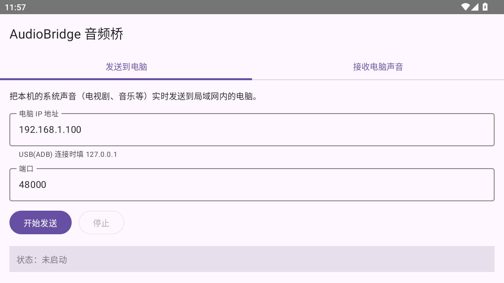
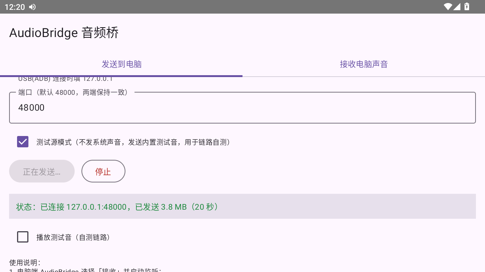

# AudioBridge 音频桥

[](https://github.com/StoneBeast/audiobridge/actions/workflows/ci.yml)
[](https://github.com/StoneBeast/audiobridge/releases)
[](LICENSE)

把**一台设备的系统声音**通过**局域网或 USB** 实时分享给另一台设备播放。
Windows（Rust）与 Android（Kotlin）双端，共享同一套 Rust 协议核心。

典型场景：用安卓手机看电视剧，同时在电脑上戴着耳机 —— AudioBridge 让耳机里也
能听到电视剧的声音（反之亦然：电脑的声音也可以发到手机上）。

| Android 发送端 | 已连接状态 |
| --- | --- |
|  |  |

## 功能特性

- **系统声音采集**（不是麦克风！）：
  - Windows：WASAPI loopback（无需虚拟声卡、无需管理员）
  - Android：MediaProjection + AudioPlaybackCapture（Android 10+，系统弹窗授权）
- **自动发现**：接收端固定端口 48000，发送端一键 UDP 广播扫描局域网，
  点「连接」即用，无需手填 IP（跨路由/AP 隔离网络或 USB 场景仍可手动指定）
- **两个平台互为收发端**：Android→PC、PC→Android、Android→Android、PC→PC 均可
- **传输**：TCP 直连（局域网）；USB 场景经 ADB `reverse` 隧道（同一协议）
- **低延迟**：48kHz 立体声 S16LE + 抖动缓冲 + 水位自动校准（防时钟漂移），
  端到端延迟典型 110~150ms（可调至 30ms）
- **应用内更新**：两端自动检查新版本，应用内下载；PC 端一键替换重启，
  Android 端调起系统安装
- **测试源模式**（Android）：不发系统声音、改发内置测试音，用于链路自测与
  ROM 不支持音频回采的设备（如部分模拟器）
- **可调音量**（接收端）、**访问令牌**（可选）、连接状态与丢包/欠载统计
- **一致性测试向量**：Rust 与 Kotlin 双实现共享同一份字节级测试
  （[`protocol/conformance-vectors.json`](protocol/conformance-vectors.json)）

## 下载

到 [Releases](https://github.com/StoneBeast/audiobridge/releases/latest) 页面：

| 文件 | 说明 |
| --- | --- |
| `audiobridge-windows-x64.zip` | Windows 桌面应用 + CLI（解压即用） |
| `AudioBridge-v*.apk` | Android 应用（Android 10+） |

安装后两端会自动检查更新；也可以直接在应用内一键升级。

> Android 应用更新时，系统会要求授予「安装未知应用」权限，跟随提示允许即可。

## 快速开始

### 场景一：局域网（手机的声音 → 电脑耳机）

1. 电脑端：启动 `audiobridge.exe` → 角色「接收端」→ 开始接收（默认端口 48000）；
   **首次监听时 Windows 防火墙弹窗要点「允许」**；
2. 手机端：安装 AudioBridge APK → 「发送到电脑」→ **扫描局域网设备** →
   在列表中点「连接」→ 在系统弹窗中允许「录制/投射音频」；
3. 电脑端状态变为「已连接」，戴耳机即可听到手机声音。

### 场景二：USB 数据线（更稳、延迟更低）

1. 手机开启 USB 调试并连接电脑（`adb` 需在 PATH 中）；
2. 电脑端：发送端 → 高级 → **USB(ADB) 接入** 建立隧道（自动改目标为 127.0.0.1）；
3. 手机端：手动地址填 `127.0.0.1`，端口 48000，开始发送。

> USB 方向说明：`adb reverse` 把电脑端口映射到手机侧，因此**手机发送、电脑接收**
> 是标准用法。反方向请用局域网。

### 命令行（可选）

```bash
audiobridge-cli listen --port 48000 --sink speaker     # 电脑端接收并播放
audiobridge-cli send   --host 192.168.1.50 --port 48000 # 电脑端采集系统声音发送
audiobridge-cli probe  --port 48000                     # 扫描局域网接收端
audiobridge-cli tone   --freq 440 --seconds 3           # 本机播放测试音
```

## 组成

| 组件 | 说明 | 技术 |
| --- | --- | --- |
| `crates/core` | 协议、抖动缓冲、水位校准、设备发现、会话层（平台无关） | Rust（仅 std） |
| `crates/audio` | WASAPI loopback 采集与播放 | Rust |
| `crates/desktop` | Windows 桌面应用（含应用内更新） | Rust + egui |
| `crates/cli` | 命令行收发工具（测试/自动化） | Rust |
| `android/` | Android 应用（发送+接收+应用内更新） | Kotlin + Compose |
| `protocol/` | Rust/Kotlin 共享的协议一致性测试向量 | JSON |
| `docs/` | 设计文档、协议规范、构建与使用手册 | Markdown |

## 文档索引

- [架构设计](docs/architecture.md) —— 技术选型、模块划分、线程模型、延迟预算
- [线协议规范](docs/protocol.md) —— 字节级协议定义（TCP 流协议 + UDP 发现）与容错约定
- [构建：Windows](docs/build-windows.md) / [构建：Android](docs/build-android.md)
- [使用手册](docs/usage.md) —— 场景步骤、指标含义、故障排查
- [路线图](docs/roadmap.md) —— Opus、多平台、UDP 模式等

## 从源码构建

克隆本仓库后：

- Windows 桌面端：`cargo build --release --workspace`（详见 [docs/build-windows.md](docs/build-windows.md)）
- Android：`cd android && gradlew assembleRelease`（详见 [docs/build-android.md](docs/build-android.md)）
- 全部测试：`cargo test --workspace` + `gradlew :app:testDebugUnitTest`
- CI：push 自动跑测试；推 `v*` tag 自动构建双平台并发布 Release
  （工作流见 [.github/workflows/](.github/workflows/)）

## 已知限制（v0.3）

- 线协议 v1 固定 48kHz/立体声/PCM，未压缩（约占 1.6 Mbps 带宽，WiFi 可承受）；
  Opus 编码已在协议中预留。
- 局域网延迟典型 110~150ms（蓝牙耳机级别），适合观影场景，不适合节奏游戏。
- Android 采集端只能采集 `USAGE_MEDIA/GAME/UNKNOWN` 的音频（通话、DRM 保护内容除外）。
- 部分 Android 模拟器 ROM 不支持系统音频回采（可用应用内「测试源模式」验证链路）。

## 安全说明

- 传输为局域网明文协议，可选「访问令牌」（SHA-256 摘要校验）防随手蹭连；
- 本仓库内的 Android 签名密钥（`android/keystore/release.jks`，密码见构建文档）
  **仅供个人使用场景**，用于保证 GitHub Actions 与本地构建签名一致、
  应用内更新可覆盖安装。若你要公开发布分发，请务必替换为自己的密钥
  并改用 GitHub Secrets 管理。

## 许可

MIT（见 [LICENSE](LICENSE)）
